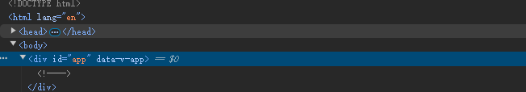

## 背景

新项目使用 `vue-router` 进行路由管理，采用的是 ```history``` 模式。

路由设置如下：

```ts
const routes = [
  {path: '/', component: Home},
  {path: '/about', component: About}
]
const router = createRouter({
  history: createWebHistory(),
  routes,
})
```

在开发过程中，页面加载正常。但是，当项目部署到服务器之后，访问对应页面时，页面会出现白屏现象。

## 原因分析

打开控制台，查看 dom 结构后发现，`<div id="app"></div>` 元素内没有挂载任何元素。因此，猜测是该路由对应的组件没有加载，导致页面白屏



查阅文档可知，在 `createWebHistory` 函数中，可以设置 `base` 参数，用于指定路由的基础路径。

正是因为没有设置 base 参数，路由匹配失败，从而导致页面出现白屏

## 追根溯源

通过对源码打断点，最终发现路由匹配与 base 的关系如下：

1. 获取当前 window 上的 location 对象，拿到 path 值
2. 去除 path 中的 base 值，获得当前路由 currentPath
3. 使用 currentPath 与路由列表进行匹配

```ts
window.location.pathname = '/about'
base = '/about'
currrentPath = '/'

window.location.pathname = '/about'
base = ''
currrentPath = '/about'
```
源码中对 base 的处理如下：

```ts
// packages/router/src/history/html5.ts
/**
 * Creates a normalized history location from a window.location object
 * @param base - The base path
 * @param location - The window.location object
 */
function createCurrentLocation(
  base: string,
  location: Location
): HistoryLocation {
  const { pathname, search, hash } = location
  // allows hash bases like #, /#, #/, #!, #!/, /#!/, or even /folder#end
  const hashPos = base.indexOf('#')
  if (hashPos > -1) {
    let slicePos = hash.includes(base.slice(hashPos))
      ? base.slice(hashPos).length
      : 1
    let pathFromHash = hash.slice(slicePos)
    // prepend the starting slash to hash so the url starts with /#
    if (pathFromHash[0] !== '/') pathFromHash = '/' + pathFromHash
    return stripBase(pathFromHash, '')
  }
  const path = stripBase(pathname, base)
  return path + search + hash
}
```


```ts
// packages/router/src/location.ts
/**
 * Strips off the base from the beginning of a location.pathname in a non-case-sensitive way.
 *
 * @param pathname - location.pathname
 * @param base - base to strip off
 */
export function stripBase(pathname: string, base: string): string {
  // no base or base is not found at the beginning
  if (!base || !pathname.toLowerCase().startsWith(base.toLowerCase()))
    return pathname
  return pathname.slice(base.length) || '/'
}
```

因此，根据项目资源在服务器中的位置：

1. 根目录：项目访问地址为 `https://test.abc.cn`， 这种情况下，使用 `history` 模式时，不需要设置 `base` 参数
2. 非根目录：项目部署地址为 `https://test.abc.cn/sub/project1`, 这种情况下，需要设置 `base` 参数，base 参数就是 `/sub/project1/`


